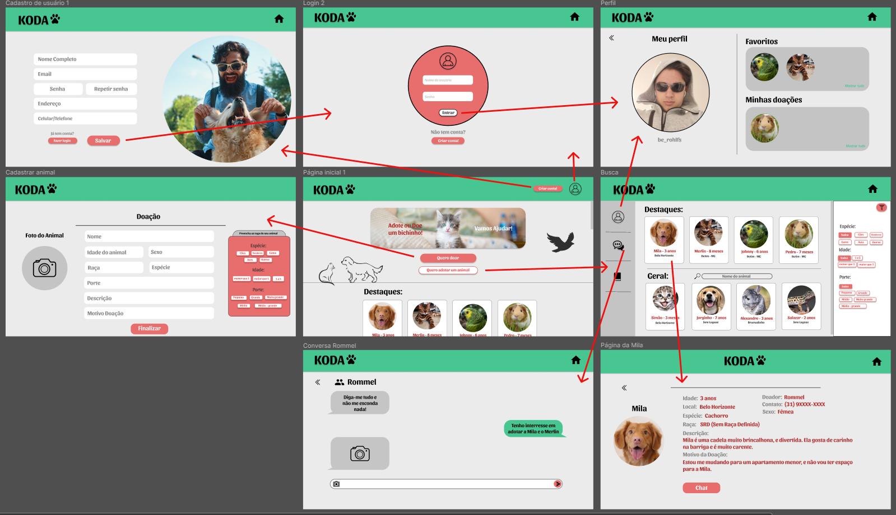
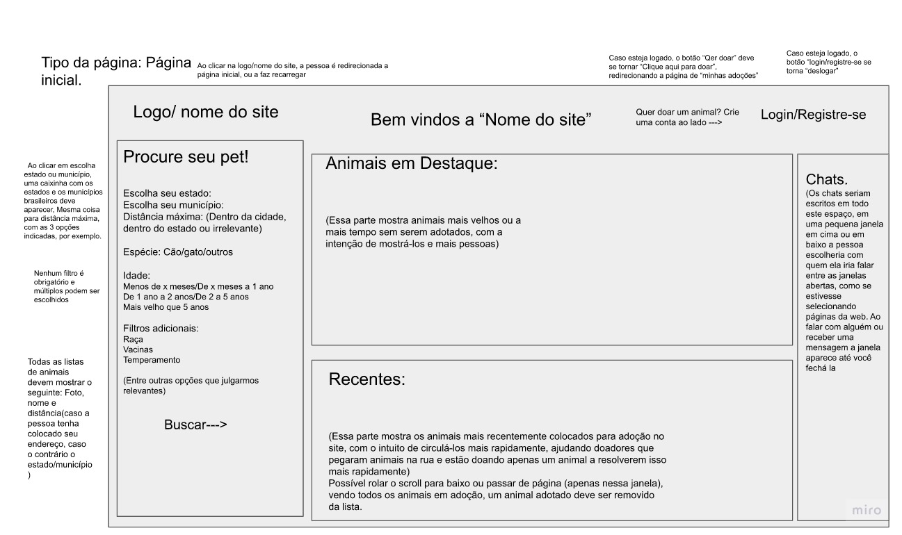
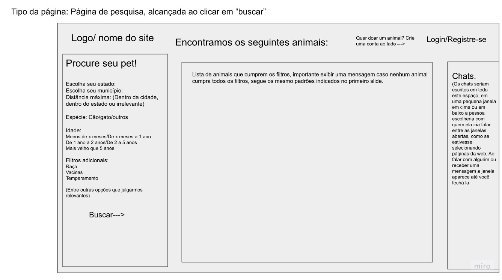
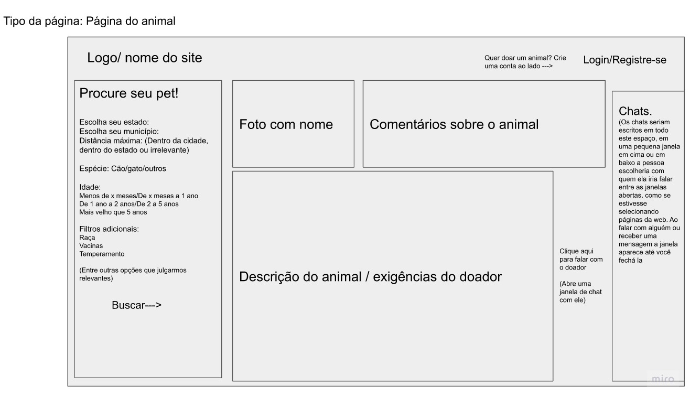
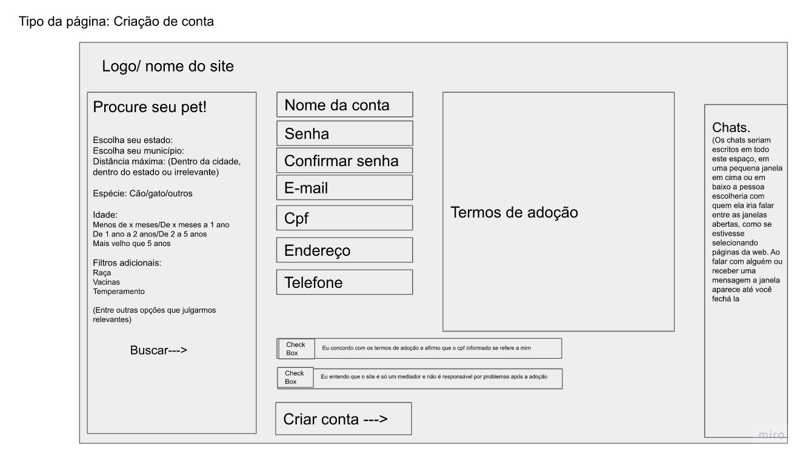
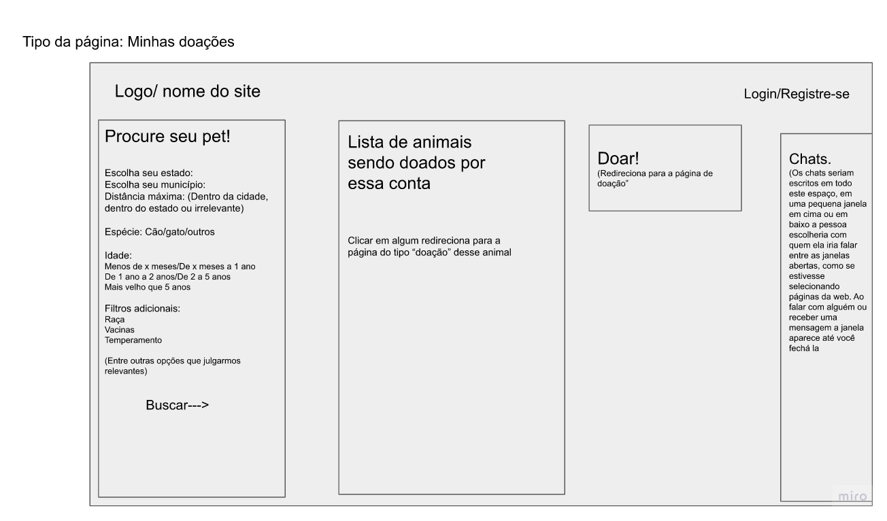
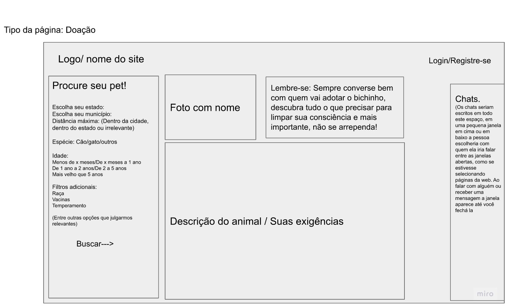

# Interface:
  - O design da interface foi elaborado para subdividir os principais requisitos funcionais do programa (ferramenta de busca, doação e adoção de animais, chat e cadastro de usuários). Além disso, focamos em respeitar as delimitações dos requisitos não funcionais, deixando a interface fluida e intuitiva ao usuário.  - Buscamos adequar a nossa plataforma de acordo com as necessidades encontradas ao analisarmos as histórias de usuário.
# Protótipo Figma
<https://www.figma.com/file/R7JGhIDCASxvekwT8CCXat/Protótipo?node-id=1%3A6>
# USER FLOW

# Wireframes

