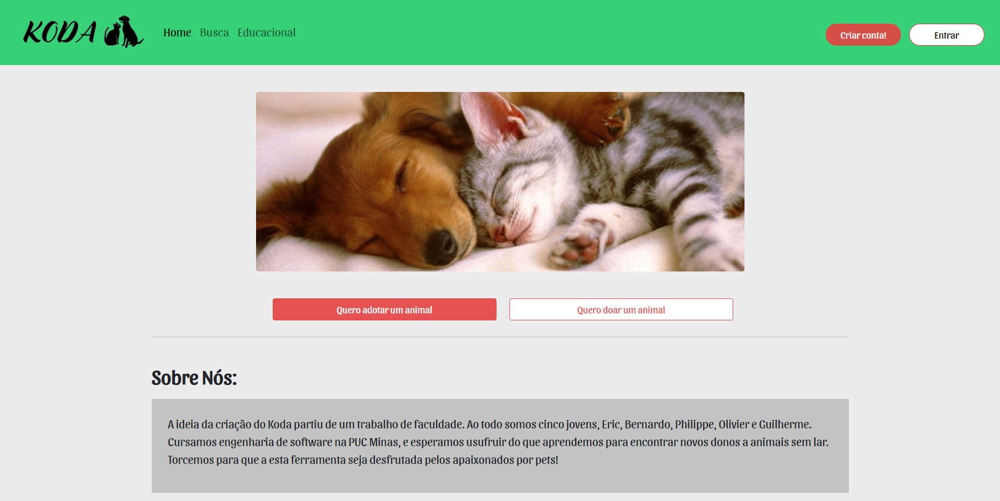
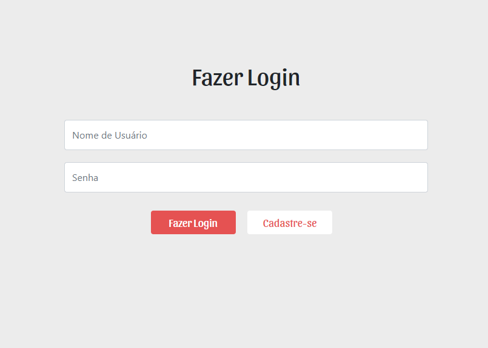
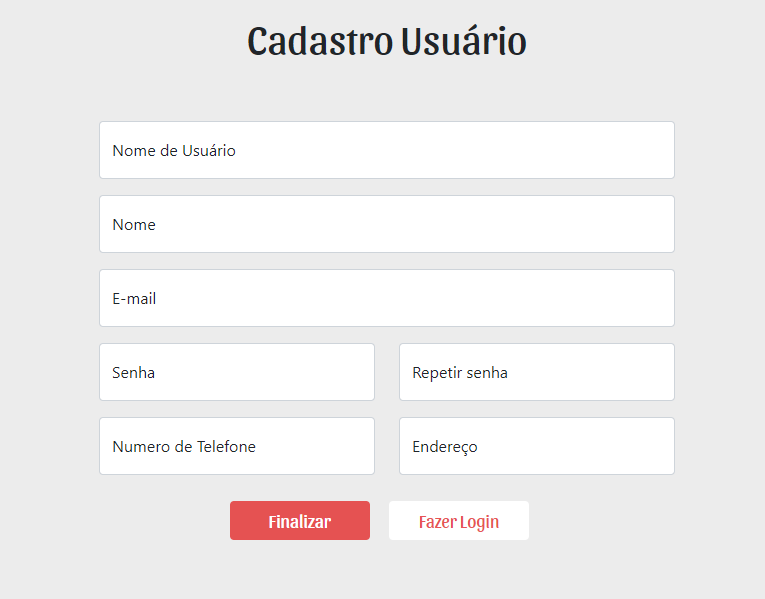
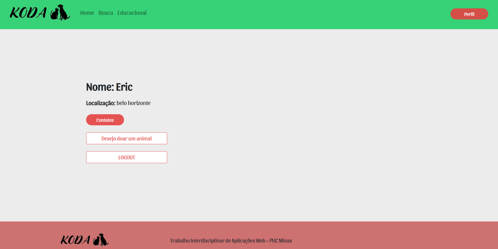
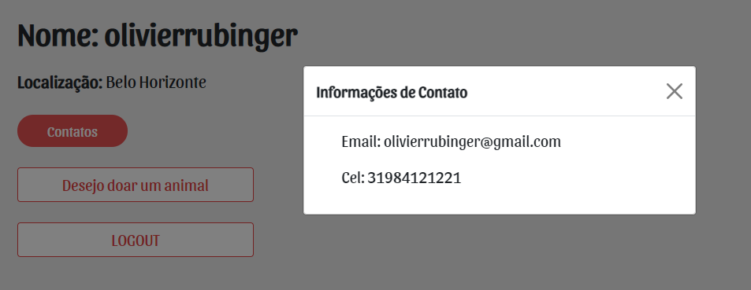
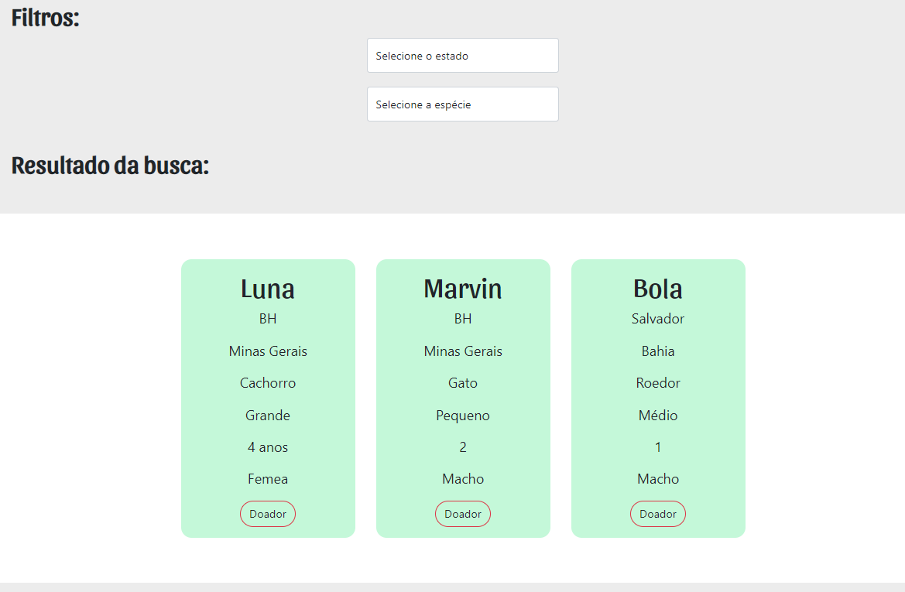
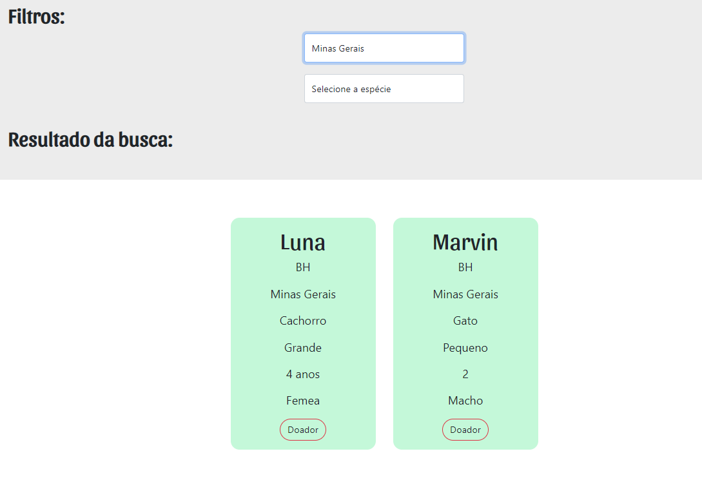
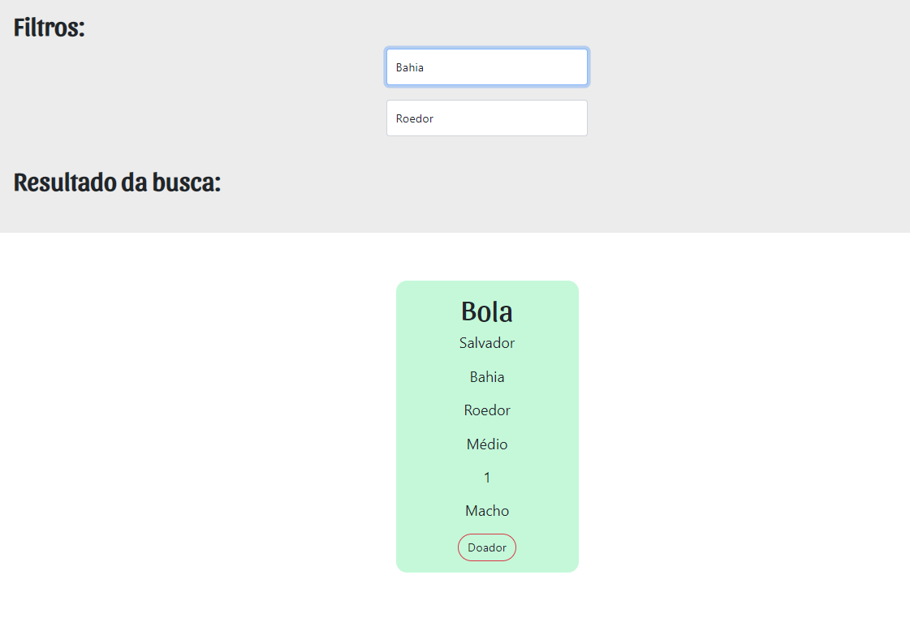
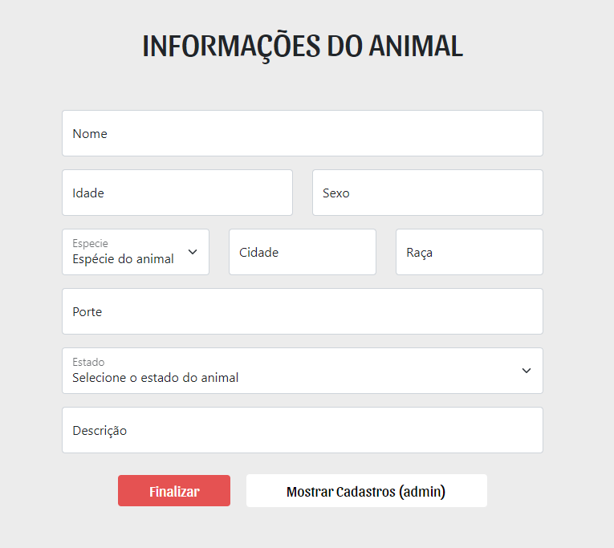
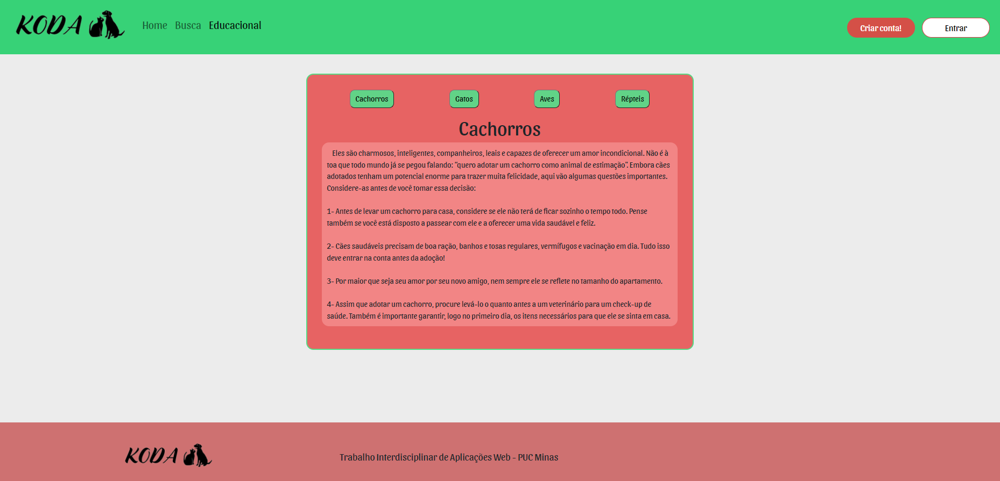

# Tecnologias Utilizadas

Linguagens Utilizadas: HTML, CSS, JavaScript.
IDE: VSCode, Replit.

A programação foi feita inicialmente no VSCode, divida em 2 sprints e separadas individualmente entre os participantes do projeto. 
Cada integrante ficou responsável de entregar um Artefato onde foram feitos o Upload numa branch master dentro do GitHUB.
No sprint final, todos os documentos foram organizados e postados em um diretório do Replit, onde foi feita a hospedagem, e a programação colaborativa de todos os integrantes.

# Arquitetura da solução

## Página Principal: 

Ao clicar em Entrar no canto superior direito da tela somos redirecionados para a **Tela de Login**, ao clicar na opção de cadastrar somos redirecionados para a **Tela de Cadastro**.
No Botão de "Quero adotar um animal" vamos para a **Página de Busca**, ao clicar em "Quero doar um animal" vamos para o **Cadastro do Animal**. A barra de Navegação possui shortcut para a **Página de Busca**, e o **Conteúdo Educacional**.

## Tela de Login: 

A tela de login pede as credenciais do usuário e sua senha. Nela podemos clicar em "Cadastre-se" para irmos à **Tela de Cadastro**. Ao efetuar o Login, o usuário é redirecionado para o **Perfil do Usuário**.

## Tela de Cadastro: 

A tela de cadastro pede informações básicas para serem cadastradas no banco de dados do site. Ao Cadastrar ou clicar no botão "Fazer Login" somos redirecionados para a **Tela de Login**.

## Perfil do Usuário: 

No perfil do usuário as informações cadastradas são mostradas. Ao clicar em "Desejo Doar um Animal" o usuário é redirecionado para o **Cadastro do Animal**. Ao clicar em "LOGOUT" o usuário é redirecionado para a **Página Principal** e o usuário é desconectado de sua conta.

## Página de Busca: 

Na Página de busca podemos selecionar filtros que nos ajudariam a escolher os pets a serem adotados com mais facilidade. ao clicar em "Doador" somos redirecionados para a página do doador com suas informações e contato.

## Cadastro do Animal: 

A tela de cadastro do animal pede informações básicas para serem cadastradas no banco de dados do site. Essa tela pode ser somente acessada por usuários logados no site. A opção de "Mostrar Cadastros (admin) ''e somente mostrada para contas consideradas como "admin".

## Conteúdo Educacional: 

A tela de conteúdo educacional mostra informações e dicas para cuidar de seus pets.
